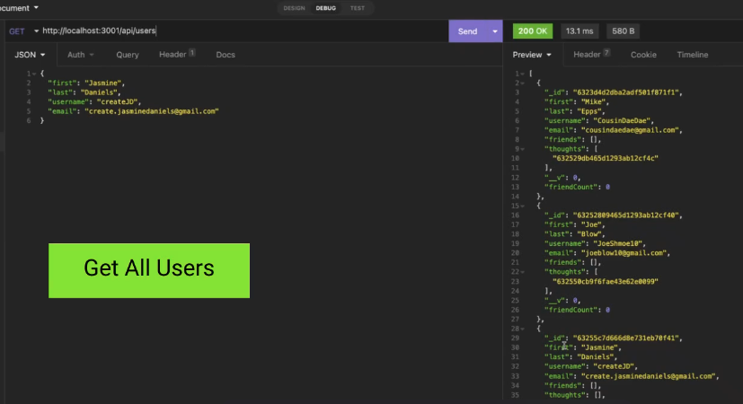

# Welcome to Talk To Me API!

## Description

Talk to me API was designed to show user interactions, data relationships, and data persistence for ease of data maintenance for social media applications. 

Talk to me API features a MongoDB database and objects are mapped using the Mongoose ODM. 

## Table of Contents

- [Installation](#installation)

- [License](#license)

- [Contact](#contact)


## Installation

### 1. Git Clone API
### 2. ``` npm start ```

### Demo Link:

## [TTM API Demo](https://youtu.be/ml_dtzRTB3I)

### Demo Image 


## License

[](https://opensource.org/licenses/ISC)

## Contact

### Email

[Contact Email](mailto:create.jasminedaniels@gmail.com)

### Github

[Github](https://github.com/JasmineDaniels)